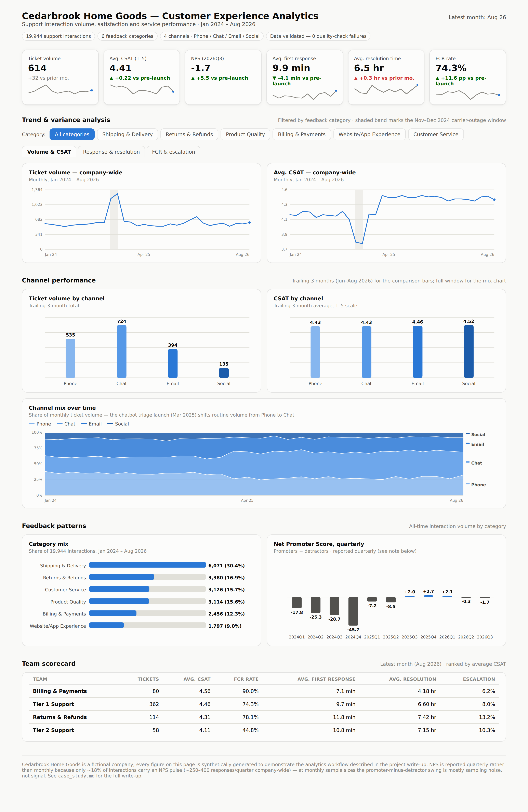
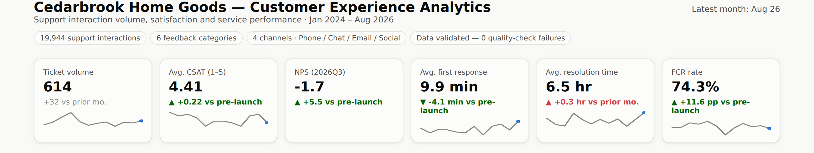
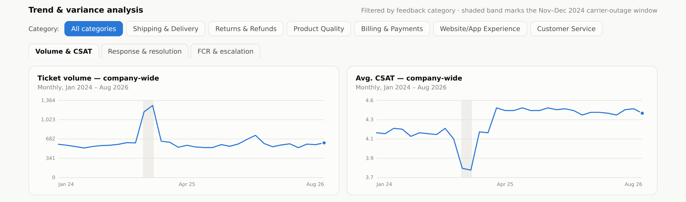

# Cedarbrook CX Pulse — Customer Experience Analytics Dashboard

An interactive customer-experience KPI dashboard, styled as a Power BI-style report, backed by a documented SQL + Excel/Power Query data pipeline.

**[View the live dashboard →](https://jjgohildev.github.io/cx-analytics-dashboard/)**

`SQL` · `Excel (Power Query)` · `Power BI Desktop (DAX)` · `JavaScript / SVG`

> Note: Cedarbrook Home Goods is a fictional company. Every figure in this project is synthetically generated (Python/pandas/Faker) to demonstrate the workflow end to end — no real customer data is used. See [`data/`](data) for how it was generated.

---

## Screenshots

**Full dashboard**


**KPI tiles**


**Trend charts** — ticket volume & CSAT vs. a carrier-outage disruption and a self-service launch


---

## The problem

Cedarbrook's CX team tracked customer satisfaction, feedback patterns, and service performance across separate ticketing-system exports and spreadsheets. Nobody could say with confidence whether a rough week in support was a blip or a trend, which feedback categories were actually driving dissatisfaction, or whether a fix (more staffing, a new self-service tool) had moved the numbers — by the time a report was assembled, the answer was already a month stale.

## Approach

**Data cleaning — SQL + Power Query.** Ticketing-system exports arrive messy: inconsistent category/channel text, missing response-time values, duplicate rows, and the occasional out-of-range survey score. `excel/CX_Analytics_KPI_Workbook.xlsx` documents a repeatable Power Query cleaning pass (trim/normalize text, enforce data types, remove duplicates, range-check CSAT, fill gaps from category-month medians) — its `Raw_Export_Sample` sheet shows the "before" state next to the cleaned tables.

**Data validation.** [`sql/cx_kpi_queries.sql`](sql/cx_kpi_queries.sql) closes with nine explicit data-quality checks — orphan keys, duplicate IDs, out-of-range CSAT/NPS, survey fields populated without a survey being sent, and resolution time impossibly shorter than first-response time. Every check returns zero against the cleaned data; a nonzero count is the signal that a cleaning step needs another look before the KPIs can be trusted.

**KPI modeling — SQL.** The same SQL file computes the company-wide monthly trend, feedback-category variance month over month, channel performance, a quarterly NPS rollup, an agent scorecard, category volume mix, and a pre/post-launch variance summary.

**Dashboard.** [`index.html`](index.html) is a single self-contained interactive report: 6 headline KPI tiles with 12-month sparklines, a feedback-category filter across three pages of trend charts, channel performance and channel-mix-over-time views, a feedback-category breakdown, a quarterly NPS chart, and a team scorecard — built in vanilla JS/SVG, no framework or build step. It's deliberately styled after a Power BI report layout, but it is not a Power BI file — see below.

**Power BI.** [`powerbi/CX_Analytics_PowerBI.pbix`](powerbi/CX_Analytics_PowerBI.pbix) is the Power BI Desktop report: a star-schema data model, every DAX measure behind the dashboard's numbers, and five report pages (Overview, Trends, Channel performance, Feedback patterns, Team scorecard) built directly on the same fact/dimension tables in [`data/`](data). `powerbi/DATA_MODEL.md` and `powerbi/DAX_MEASURES.md` document the model and measure definitions, each measure with an independently-verified expected value it was checked against while building — worth a look if you want to see the reasoning, not just the finished file. `BUILD_GUIDE.md` is the step-by-step guide the report was actually built from, kept here as a record of the process (relationships, time-intelligence setup, DAX, and the styling pass) rather than as a to-do.

## What the data shows

A regional shipping-carrier outage during the Nov–Dec 2024 holiday peak drives a sharp spike in ticket volume (613 → 1,274/month) concentrated in Shipping & Delivery and Returns & Refunds, with average CSAT dropping from 4.12 to 3.77 and first-response time climbing from under 13 to nearly 23 minutes. A self-service returns portal and chatbot triage launched in March 2025 shows up as a clean step change in the opposite direction: first-contact resolution climbs from ~63% to a new baseline in the mid-70s%, average first-response time drops below its pre-outage level, and CSAT settles into a new high around 4.4–4.5. Quarterly NPS follows the same arc, recovering from a trough of -45.7 during the outage quarter to roughly breakeven by late 2025.

## Outcome

- A single, validated source of truth for ticket volume, CSAT, NPS, response/resolution time, and first-contact resolution, with the underlying data quality checked at every load.
- A feedback-category and channel view that shows precisely where a service disruption is concentrated, instead of a company-wide average that hides it.
- A documented before/after read on the self-service launch that a team can put in front of stakeholders to justify the investment — first-contact resolution up roughly 12 points, first-response time down by several minutes, CSAT up over two tenths of a point.

Full write-up: [`case_study.md`](case_study.md)

---

## Repo structure

```
.
├── README.md
├── index.html                        # the dashboard — open directly or serve via GitHub Pages
├── case_study.md                     # full project write-up
├── screenshots/
│   ├── full_dashboard.png
│   ├── kpi_tile_view.png
│   └── chart_pattern_view.png
├── sql/
│   └── cx_kpi_queries.sql            # KPI + data-quality queries
├── excel/
│   └── CX_Analytics_KPI_Workbook.xlsx   # raw→cleaned data, data dictionary, pivot source
├── powerbi/
│   ├── CX_Analytics_PowerBI.pbix      # the Power BI Desktop report — data model, DAX, 5 report pages
│   ├── DATA_MODEL.md                 # star schema + relationships
│   ├── DAX_MEASURES.md               # every measure, with expected values to validate against
│   └── BUILD_GUIDE.md                # step-by-step Power BI Desktop build (as-built record)
└── data/
    ├── README.md                     # how the dataset was generated
    ├── dim_date.csv                  # daily date dimension (Power BI time intelligence)
    ├── dim_channel.csv               # channel dimension with display sort order
    └── cedarbrook_cx_csv_tables.zip  # dim/fact CSVs — import straight into Power BI Desktop
```

## Publishing the live demo

`index.html` is fully self-contained (no build step, no external data files) so GitHub Pages can serve it directly:

1. Push this folder to a GitHub repo (as its own repo, or a subfolder of your portfolio repo).
2. In the repo, go to **Settings → Pages**.
3. Under **Build and deployment → Source**, choose **Deploy from a branch**.
4. Pick the branch and, if `index.html` sits in a subfolder, that folder (e.g. `/docs` — you'd need to move/copy `index.html` there, since Pages only offers `/` or `/docs`).
5. Save. GitHub gives you a URL like `https://<username>.github.io/<repo>/` (or `.../<repo>/<subfolder>/` for a subfolder project) within a minute or two.
6. Swap that URL into the **View the live dashboard** link at the top of this README, and into your portfolio site's "View Project" button.

## Tech stack

SQL · Excel (Power Query) · HTML/CSS/JavaScript (SVG charts, no external libraries), styled as a Power BI-style report · Power BI Desktop (star-schema data model + DAX measures + 5-page report — see [`powerbi/CX_Analytics_PowerBI.pbix`](powerbi/CX_Analytics_PowerBI.pbix))
