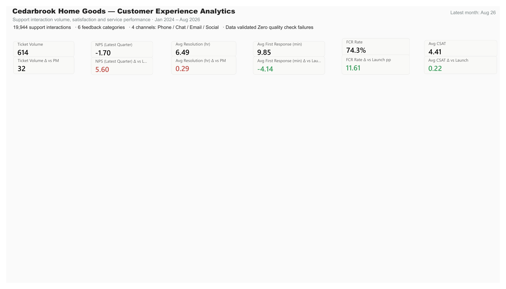
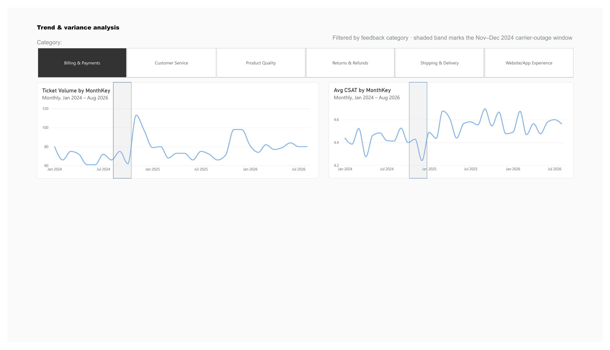

# Customer Experience Analytics: Case Study

I built this project to bring customer-support metrics into a report that is easier to explore than separate tables. My focus was on preparing the data, defining useful KPIs, and presenting the results in Power BI.

**Tools:** Power BI, DAX, SQL, Excel, and Power Query  
**Project type:** Personal portfolio project  
**Data period:** January 2024 to August 2026

Cedarbrook Home Goods is fictional, and the data is synthetic. The service disruption and self-service launch are scenarios built into the dataset, not events at a real employer or client.

## Questions behind the report

- How do ticket volume and customer satisfaction change over time?
- Which feedback categories and support channels need closer attention?
- How do response times and first-contact resolution differ around the simulated self-service launch?

These questions guided the measures and report structure.

## Preparing the data

The project includes interaction records and supporting tables for customers, agents, feedback categories, channels, and dates. I used SQL and Excel Power Query to structure the data for analysis.

The preparation workflow covers inconsistent text, duplicate records, missing values, and invalid survey scores. The Excel workbook includes a raw-export sample to document the cleaning process.

Survey blanks need particular care. An interaction without a survey response should not contribute a zero to the average satisfaction score. Response and resolution times also need consistent units before comparison.

The [SQL file](sql/cx_kpi_queries.sql) includes checks for duplicate IDs, missing related records, invalid survey values, and inconsistent response and resolution times. These checks should be rerun whenever the input changes. Including them in the repository does not guarantee that future refreshes will pass.

## Building the Power BI report

I organized the report around an interaction-level fact table and supporting dimensions. This allows measures to be explored by date, category, channel, and team.

The main KPIs are ticket volume, average CSAT, NPS, average first-response time, average resolution time, and first-contact resolution rate. The [DAX documentation](powerbi/DAX_MEASURES.md) records definitions and reference values. Comparisons require matching filters, especially when NPS uses quarterly data while other cards show one month.

The report contains five pages: Overview, Trends, Channel performance, Feedback patterns, and Team scorecard. The first two are shown below.

### Overview

The saved view shows August 2026, with 614 tickets, average CSAT of 4.41, and a first-contact resolution rate of 74.3%. These values describe the synthetic dataset.

### Trends

This page places ticket volume and customer satisfaction side by side so their changes can be compared over time. A category selector supports a closer look at individual types of feedback.

This screenshot is filtered to **Billing & Payments**. It is not the company-wide view and should not be used to illustrate changes in Shipping & Delivery.

## Interpreting the scenarios

The dataset includes a simulated shipping disruption in November and December 2024 and a self-service initiative beginning in March 2025. These provide comparison periods for the analysis.

For the disruption period, category-level comparisons matter. A stable category can look different from one directly affected by the scenario. Ticket volume, satisfaction, and response times should be compared across categories before drawing an overall conclusion.

For the self-service scenario, first-contact resolution and response time are useful starting points. A before-and-after comparison describes a change but does not establish that the initiative caused it. Channel mix, ticket volume, and survey participation also affect interpretation.

## What the project delivers

The repository brings together a native Power BI report, source tables, SQL queries, an Excel workbook, and supporting documentation. It demonstrates my work in data preparation, KPI reporting, and interactive analysis.

A separate [web demo](https://jjgohildev.github.io/cx-analytics-dashboard/) presents the project using HTML, CSS, and JavaScript. It is not an embedded PBIX report. The screenshots above come from Power BI Desktop.

## Limitations and next steps

Synthetic data cannot establish real customer behavior or business results. Survey metrics also need response counts to provide context.

The current Overview page has unused canvas space and some shortened KPI labels. My next design pass would tighten the layout, improve comparison labels, and clarify active filters. I would also reconcile the displayed measures against SQL with matching filters and record those checks explicitly.

[Back to the project overview](README.md)
