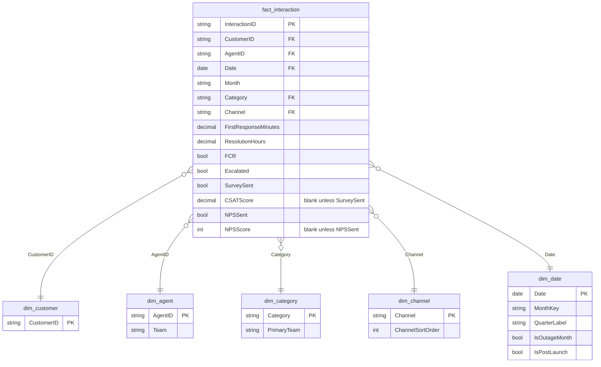

# Power BI data model

A star schema: one fact table at interaction grain, four dimension tables. Every
table below is a CSV already sitting in `../data/` — nothing new to generate
except `dim_date.csv` and `dim_channel.csv`, which are included for exactly
this purpose (the original data-generation script only produced the other
six; a proper Power BI model needs a marked date table and benefits from a
small sort-order dimension for Channel, so those two were added).



## Tables and relationships

| From | To | Cardinality | Cross-filter | Active? |
|---|---|---|---|---|
| `fact_interaction[CustomerID]` | `dim_customer[CustomerID]` | many-to-one | single | Yes |
| `fact_interaction[AgentID]` | `dim_agent[AgentID]` | many-to-one | single | Yes |
| `fact_interaction[Category]` | `dim_category[Category]` | many-to-one | single | Yes |
| `fact_interaction[Channel]` | `dim_channel[Channel]` | many-to-one | single | Yes |
| `fact_interaction[Date]` | `dim_date[Date]` | many-to-one | single | Yes |

All relationships are single-direction (dimension filters fact), which is the
default and correct choice here — there's no need for bidirectional filtering
anywhere in this model. Import mode (not DirectQuery) — the data's static
CSVs, so there's no live source to query against.

## Why a separate `dim_date` table

`fact_interaction` already has a `Date` and a `Month` (text `"YYYY-MM"`)
column, and it's tempting to build time intelligence straight off those. Two
reasons not to:

1. **`DATEADD`, `SAMEPERIODLASTYEAR`, `PREVIOUSMONTH` and friends require a
   table marked as a Date table** with one contiguous row per calendar day
   and no gaps — a column embedded in a fact table can't be marked that way.
2. Two of the events this dataset tells a story about (the outage, the
   self-service launch) are calendar-boundary events. Having `IsOutageMonth`
   and `IsPostLaunch` flags already sitting on the date table means you can
   filter or color visuals by those flags without writing a single DAX
   expression to derive them from raw dates.

**After importing, right-click `dim_date` → Mark as date table → pick the
`Date` column.** Do this before writing any time-intelligence measure or
they'll silently return blank.

## Why a separate `dim_channel` table

`Channel` already lives on `fact_interaction` as plain text, and a
relationship to a one-column dimension table might look unnecessary. It earns
its place for one reason: **visual sort order.** Without it, Power BI sorts
the Channel axis alphabetically (Chat, Email, Phone, Social) — every chart in
the original HTML dashboard sorts it Phone → Chat → Email → Social (per the
project's color-formula convention: a fixed, deliberate categorical order,
not alphabetical). `ChannelSortOrder` lets you right-click the `Channel`
column → Sort by column → `ChannelSortOrder`, once, and every visual built
against it inherits the correct order automatically.

## A note on `CSATScore` and `NPSScore` being blank, not zero

In the source CSVs, `CSATScore` is empty for any row where `SurveySent =
FALSE`, and `NPSScore` is empty where `NPSSent = FALSE` — not `0`. Confirm
Power Query imports these as blank (`BLANK()`), not `0`, before building
anything: DAX's `AVERAGE()` and `AVERAGEX()` silently skip blanks but will
happily average in a `0` and quietly wreck every CSAT/NPS measure. This is
the single most common way a DAX rebuild of this dashboard goes wrong — see
the validation note at the top of `DAX_MEASURES.md`.

## Regenerating `dim_date.csv` / `dim_channel.csv`

Both are deterministic derived tables (no random generation, so no seed to
track) — this is the exact script used to produce the versions in `../data/`:

```python
import pandas as pd

dates = pd.date_range("2024-01-01", "2026-08-31", freq="D")
df = pd.DataFrame({"Date": dates})
df["MonthKey"] = df["Date"].dt.strftime("%Y-%m")
df["MonthStart"] = df["Date"].dt.to_period("M").dt.start_time
df["Year"] = df["Date"].dt.year
df["Quarter"] = df["Date"].dt.quarter
df["QuarterLabel"] = df["Year"].astype(str) + "Q" + df["Quarter"].astype(str)
df["MonthName"] = df["Date"].dt.strftime("%B %Y")
df["MonthShort"] = df["Date"].dt.strftime("%b %y")
df["DayOfWeek"] = df["Date"].dt.day_name()
df["IsOutageMonth"] = df["MonthKey"].isin(["2024-11", "2024-12"])
df["IsPostLaunch"] = df["Date"] >= "2025-03-01"
df["Date"] = df["Date"].dt.strftime("%Y-%m-%d")
df["MonthStart"] = df["MonthStart"].dt.strftime("%Y-%m-%d")
df.to_csv("dim_date.csv", index=False)   # 974 rows

pd.DataFrame({
    "Channel": ["Phone", "Chat", "Email", "Social"],
    "ChannelSortOrder": [1, 2, 3, 4],
}).to_csv("dim_channel.csv", index=False)
```
